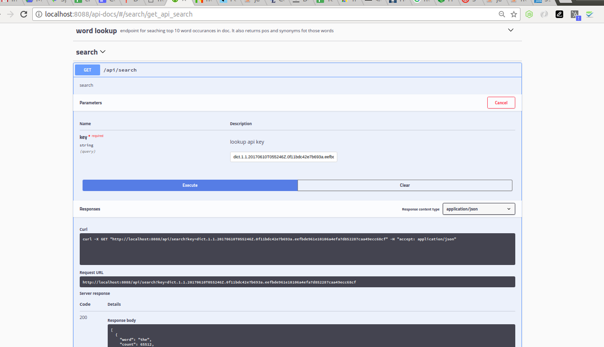

# A Basic word search in doc App(beta)


## How to run

1. Clone this repo 
   `$ git clone https://github.com/ashwinitodkar/fs-search-utility.git`
2. `$ cd ./fs-search-utility`
3. `$ npm install`
5. Start node server
   `$ node app.js`

## API Look

1. Desktop View



# API Documentation
  
  Get top 10 word ocurrances and its POS & synonyms

1. open below swagger link in browser 
   http://localhost:8088/api-docs/

   you can directly execute API from here 
   *required param - lookup api key

   OR

2. REST API CALL
```
Url: http://localhost:8088/api/search?key={lookup-api-key}
Method: GET
Response:
[
  {
    "word": "the",
    "count": 65512,
    "pronoun": {
      "syn": [
        "тот",
        "чем"
      ]
    },
    "conjunction": {
      "syn": [
        "тем"
      ]
    }
  },
  {
    "word": "of",
    "count": 35050,
    "preposition": {
      "syn": [
        "из",
        "о"
      ]
    },
    "adverb": {
      "syn": [
        "из числа"
      ]
    }
  },
  {
    "word": "and",
    "count": 31987,
    "conjunction": {
      "syn": [
        "и",
        "а также",
        "причем"
      ]
    },
    "adverb": {
      "syn": [
        "так и"
      ]
    },
    "preposition": {
      "syn": [
        "с"
      ]
    }
  },
  {
    "word": "to",
    "count": 25246,
    "preposition": {
      "syn": [
        "к",
        "с"
      ]
    },
    "conjunction": {
      "syn": [
        "чтобы"
      ]
    },
    "particle": {
      "syn": [
        "бы"
      ]
    },
    "adjective": {
      "syn": [
        "должно"
      ]
    },
    "pronoun": {
      "syn": [
        "который"
      ]
    },
    "adverb": {
      "syn": [
        "с целью"
      ]
    }
  },
  {
    "word": "in",
    "count": 18786,
    "preposition": {
      "syn": [
        "в",
        "из",
        "внутри",
        "через"
      ]
    },
    "adverb": {
      "syn": [
        "во время"
      ]
    }
  },
  {
    "word": "that",
    "count": 10146,
    "conjunction": {
      "syn": [
        "что",
        "будто",
        "дабы"
      ]
    },
    "pronoun": {
      "syn": [
        "который",
        "это",
        "тот самый"
      ]
    },
    "adverb": {
      "syn": [
        "так"
      ]
    }
  },
  {
    "word": "he",
    "count": 10128,
    "pronoun": {
      "syn": [
        "он"
      ]
    }
  },
  {
    "word": "was",
    "count": 9793
  },
  {
    "word": "his",
    "count": 8541,
    "pronoun": {
      "syn": [
        "его"
      ]
    },
    "participle": {
      "syn": [
        "принадлежащий ему"
      ]
    }
  },
  {
    "word": "is",
    "count": 8372
  }
]
```

3. CURL 
```
curl -X GET "http://localhost:8088/api/search?key=lookup-api-key" -H "accept: application/json"

Response:
[
  {
    "word": "the",
    "count": 65512,
    "pronoun": {
      "syn": [
        "тот",
        "чем"
      ]
    },
    "conjunction": {
      "syn": [
        "тем"
      ]
    }
  },
  {
    "word": "of",
    "count": 35050,
    "preposition": {
      "syn": [
        "из",
        "о"
      ]
    },
    "adverb": {
      "syn": [
        "из числа"
      ]
    }
  },
  {
    "word": "and",
    "count": 31987,
    "conjunction": {
      "syn": [
        "и",
        "а также",
        "причем"
      ]
    },
    "adverb": {
      "syn": [
        "так и"
      ]
    },
    "preposition": {
      "syn": [
        "с"
      ]
    }
  },
  {
    "word": "to",
    "count": 25246,
    "preposition": {
      "syn": [
        "к",
        "с"
      ]
    },
    "conjunction": {
      "syn": [
        "чтобы"
      ]
    },
    "particle": {
      "syn": [
        "бы"
      ]
    },
    "adjective": {
      "syn": [
        "должно"
      ]
    },
    "pronoun": {
      "syn": [
        "который"
      ]
    },
    "adverb": {
      "syn": [
        "с целью"
      ]
    }
  },
  {
    "word": "in",
    "count": 18786,
    "preposition": {
      "syn": [
        "в",
        "из",
        "внутри",
        "через"
      ]
    },
    "adverb": {
      "syn": [
        "во время"
      ]
    }
  },
  {
    "word": "that",
    "count": 10146,
    "conjunction": {
      "syn": [
        "что",
        "будто",
        "дабы"
      ]
    },
    "pronoun": {
      "syn": [
        "который",
        "это",
        "тот самый"
      ]
    },
    "adverb": {
      "syn": [
        "так"
      ]
    }
  },
  {
    "word": "he",
    "count": 10128,
    "pronoun": {
      "syn": [
        "он"
      ]
    }
  },
  {
    "word": "was",
    "count": 9793
  },
  {
    "word": "his",
    "count": 8541,
    "pronoun": {
      "syn": [
        "его"
      ]
    },
    "participle": {
      "syn": [
        "принадлежащий ему"
      ]
    }
  },
  {
    "word": "is",
    "count": 8372
  }
]
```
